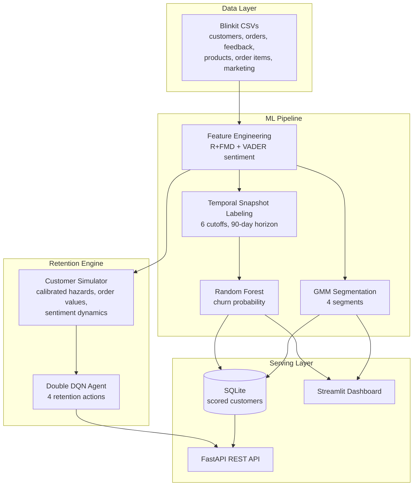

# ChurnAware: Sentiment-Aware Churn Prediction

Python, Scikit-learn, Pandas, Streamlit, FastAPI, PyTorch | September 2025 – November 2025

ChurnAware implements an RFM (Recency-Frequency-Monetary) segmentation pipeline on the Blinkit e-grocery dataset and builds a sentiment-aware churn prediction model that combines customer behavioral signals with review sentiment analysis. On top of the predictive layer, a deep reinforcement learning retention engine learns which retention action to take for each customer, and a REST API serves scores and recommendations for downstream applications.

## Table of Contents

- [Overview](#overview)
- [Research Background](#research-background)
- [System Architecture](#system-architecture)
- [Dataset](#dataset)
- [Methodology](#methodology)
- [Results](#results)
- [Project Structure](#project-structure)
- [Getting Started](#getting-started)
- [API Reference](#api-reference)
- [Roadmap](#roadmap)
- [Team](#team)
- [License](#license)

## Overview

Quick-commerce platforms lose far more revenue to silent customer churn than to failed acquisition. ChurnAware addresses this in three stages:

1. **Segmentation.** Customers are clustered with a Gaussian Mixture Model over R+FMD behavioral features (frequency, monetary value, and on-time delivery ratio), producing four actionable segments from High-Value Champions to At-Risk.
2. **Churn prediction.** A Random Forest classifier estimates each customer's probability of placing no order in the next 90 days. Labels are constructed with temporal snapshot windows so that no future information leaks into the features, and review sentiment extracted from raw feedback text is part of the feature set.
3. **Retention optimization.** A Double DQN agent, trained in a customer-behavior simulator calibrated on the dataset, chooses the retention action (do nothing, push notification, free delivery, or 10 percent discount) that maximizes long-run profit net of incentive cost.

All three layers are exposed through a FastAPI backend backed by SQLite, and an interactive Streamlit dashboard provides executive KPIs, 3D segment exploration, and a ranked at-risk customer list.

## Research Background

This project implements and extends the methodology of the following Scopus-indexed article:

> Data-driven strategic customer segmentation considering cart abandonment behavior: Insights from e-grocery delivery platforms. SJMSoM, IIT Bombay (2025).
> https://www.scopus.com/pages/publications/105006995581

The paper enhances the classical RFM model with a delivery ratio (D) metric that proxies cart abandonment behavior, and reports that Gaussian Mixture Models produce the best segment separation on the resulting R+FMD feature space. ChurnAware reproduces this R+FMD plus GMM pipeline, then extends it with text-based sentiment analysis, leak-free churn labeling, and reinforcement-learning-based retention policy optimization.

Dataset: Blinkit Marketing and Customer Feedback Dashboard (Kaggle).
https://www.kaggle.com/datasets/yashmotiani/blinkit-marketingand-customer-powerbi-dashbord

## System Architecture



The serving layer follows a batch-scoring pattern: an ingestion job engineers features, scores every customer with the churn model and the DQN policy, and materializes the results into SQLite. The API reads from this store for list endpoints and runs live policy inference for per-customer recommendation requests, with model artifacts cached in memory after first load.

## Dataset

Synthetic Blinkit operations data covering March 2023 to November 2024.

| File | Rows | Granularity |
|---|---|---|
| blinkit_customers.csv | 2,500 | One row per customer |
| blinkit_orders.csv | 5,000 | One row per order |
| blinkit_order_items.csv | 5,000 | Order line items |
| blinkit_customer_feedback.csv | 5,000 | One feedback record per order, with free text |
| blinkit_products.csv | 268 | Product catalog with margins |
| blinkit_marketing_performance.csv | 5,400 | Campaign performance records |

2,172 of the 2,500 customers have at least one order (mean 2.3 orders per customer). Delivery statuses split into On Time (69.4 percent), Slightly Delayed (20.7 percent), and Significantly Delayed (9.9 percent).

## Methodology

### Feature engineering (R+FMD and sentiment)

For each customer, the pipeline computes recency in days, order frequency, monetary value, average order value, on-time delivery ratio, delay severity score, lifespan, and order rate, together with feedback aggregates: average rating, labeled sentiment score, and VADER compound sentiment computed directly from the raw review text. The on-time ratio operationalizes the paper's delivery ratio metric using delivery punctuality, which is the dimension that actually varies in this dataset.

### Segmentation (GMM)

A four-component Gaussian Mixture Model (full covariance, 10 initializations) clusters standardized frequency, monetary, and on-time ratio features. Clusters are ranked by a composite value score and named High-Value Champions, Promising Customers, Needs Attention, and At-Risk.

### Leak-free churn labeling

Naively defining churn as "more than 90 days since last order" while recency is also a model feature makes the label a deterministic function of an input, and the model scores a meaningless 1.0 on every metric. ChurnAware instead builds six temporal snapshots (September 2023 through July 2024). At each cutoff date, features are computed only from data before the cutoff, and the label is whether the customer ordered in the 90 days after it. The model trains on the first five snapshots and is evaluated on the final, unseen snapshot, giving an honest out-of-time estimate of performance.

### Retention policy learning (Double DQN)

A weekly-step simulator models each customer as a purchase hazard process. Hazards, order value distributions, delivery delay rates, negative feedback rates, and product margins are all calibrated per segment from the dataset. Purchase probability decays with recency, responds to sentiment, and is boosted by retention actions subject to promotion fatigue; a customer who reaches 13 weeks of inactivity is absorbed into churn.

The agent observes an 8-dimensional state (recency, frequency, monetary, sentiment, on-time ratio, elapsed weeks, fatigue, last action) and chooses among four actions with realistic economics: push notifications cost little but have small effect, discounts have the strongest effect but sacrifice margin. Reward is realized profit minus incentive cost. A compact Double DQN (two 64-unit layers) is trained for 12,000 simulated customer episodes and compared against three baselines: never intervene, always discount, and a hand-crafted recency-threshold rule.

## Results

### Churn model (temporal holdout, 1,574 customers from the July 2024 snapshot)

| Metric | Value |
|---|---|
| Accuracy | 0.698 |
| ROC-AUC | 0.590 |
| F1 (churned class) | 0.806 |
| F1 (retained class) | 0.312 |
| Training rows | 3,793 across 5 snapshots |
| Base churn rate | 73.9 percent |

Top feature importances: average order value (0.177), monetary (0.159), recency (0.154), and text sentiment (0.115) — the VADER score computed from raw review text outranks the dataset's own sentiment labels, supporting the sentiment-aware design. The modest AUC is an honest reflection of a synthetic dataset with limited behavioral signal; the value of the pipeline lies in its methodology, which transfers unchanged to real transaction data.

### Retention policies (simulation, 5,000 customers, 39 weeks)

| Policy | Net profit per customer | Retention rate | Incentive spend |
|---|---|---|---|
| Never act | Rs. 361.75 | 2.1 percent | Rs. 0.00 |
| Always discount | Rs. 378.65 | 3.5 percent | Rs. 212.96 |
| Rule-based | Rs. 430.17 | 3.1 percent | Rs. 91.21 |
| Double DQN | Rs. 423.88 | 3.1 percent | Rs. 126.69 |

The learned policy delivers a 17 percent profit uplift over never intervening and is statistically on par with the hand-crafted rule, without any domain knowledge: it discovers on its own that incentives should be concentrated on lapsing customers rather than sprayed across the base. Simulation parameters (action effects, costs, fatigue) are documented assumptions in `src/rl/simulator.py`; in production they would be replaced by estimates from A/B experiments.

## Project Structure

```
Churnaware/
├── data/                          Blinkit source CSVs
├── models/                        Trained artifacts, engineered features, metrics
├── notebooks/                     EDA and feature prototyping
├── reports/                       RL policy evaluation results
├── src/
│   ├── data_loader.py             CSV loading
│   ├── utils.py                   Paths, model persistence helpers
│   ├── train_segmentation.py      Segmentation pipeline entry point
│   ├── train_churn.py             Churn pipeline entry point
│   ├── dashboard.py               Streamlit dashboard
│   ├── Mymodules/
│   │   ├── feature_engineering.py R+FMD and sentiment features
│   │   ├── labeling.py            Temporal snapshot dataset builder
│   │   ├── segmentation.py        GMM clustering and segment naming
│   │   └── modeling.py            Random Forest training and evaluation
│   └── rl/
│       ├── simulator.py           Calibrated customer environment
│       ├── dqn.py                 Double DQN implementation
│       ├── policies.py            Baseline policies
│       ├── train_agent.py         Agent training entry point
│       └── evaluate.py            Policy comparison
└── backend/
    ├── app/
    │   ├── main.py                FastAPI application
    │   ├── ingest.py              Batch scoring into SQLite
    │   ├── services.py            Model loading and inference
    │   ├── schemas.py             Pydantic response models
    │   ├── db.py                  SQLite engine
    │   └── routers/               customers, segments, churn, retention, kpi
    ├── Dockerfile
    └── requirements.txt
```

## Getting Started

Requires Python 3.11 or later.

```bash
git clone https://github.com/PrasannaMishra001/ChurnAware.git
cd ChurnAware
python -m venv venv
venv\Scripts\activate          # Windows
# source venv/bin/activate     # Linux / macOS
pip install -r requirements.txt
```

Train the models (artifacts are written to `models/`):

```bash
python -m src.train_segmentation
python -m src.train_churn
python -m src.rl.train_agent
python -m src.rl.evaluate
```

Run the dashboard:

```bash
streamlit run src/dashboard.py
```

Run the API (ingests into SQLite automatically on first start; interactive documentation at http://127.0.0.1:8000/docs):

```bash
uvicorn backend.app.main:app --port 8000
```

Or with Docker:

```bash
docker build -f backend/Dockerfile -t churnaware-api .
docker run -p 8000:8000 churnaware-api
```

## API Reference

| Method | Endpoint | Description |
|---|---|---|
| GET | /api/health | Service health check |
| GET | /api/kpi/summary | Portfolio KPIs: revenue, risk counts, segment mix |
| GET | /api/customers | Paginated customer list with segment and frequency filters |
| GET | /api/customers/{id} | Full customer profile with churn score and recommended action |
| GET | /api/segments | GMM segment profiles |
| GET | /api/churn/top-risk | Customers ranked by churn probability |
| GET | /api/churn/metrics | Churn model evaluation metrics |
| GET | /api/retention/actions | Retention action catalog with costs and effects |
| GET | /api/retention/recommend/{id} | Live DQN recommendation with per-action Q-values |

## Roadmap

- React frontend consuming the API, deployed on Vercel, with the containerized backend on Render
- PostgreSQL and a job queue replacing SQLite for the ingestion path
- Transformer-based feedback intelligence: complaint topic mining and retrieval over review text
- Off-policy evaluation of retention policies against logged interventions
- Event-driven scoring pipeline for streaming order and feedback updates

## Team

BE Project, ABV-Indian Institute of Information Technology and Management, Gwalior.

- Malladi Nagarjuna (2023IMT-050)
- Prasanna Mishra (2023IMT-059)
- Prasun Baranwal (2023IMT-060)
- Shivam Deolankar (2023IMT-073)

## License

Released under the MIT License. See [LICENSE](LICENSE) for details.
